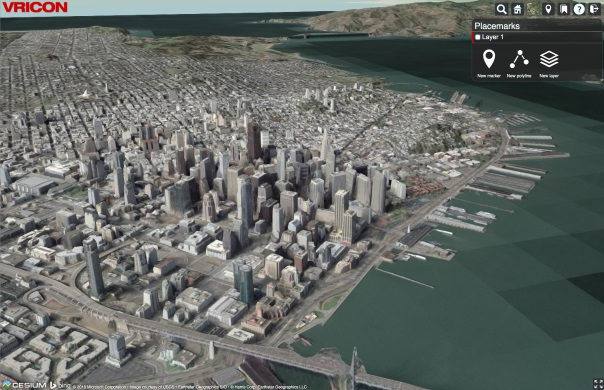
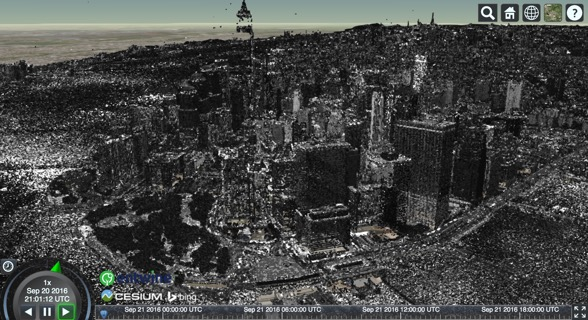
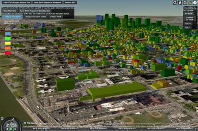
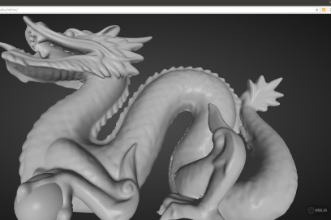
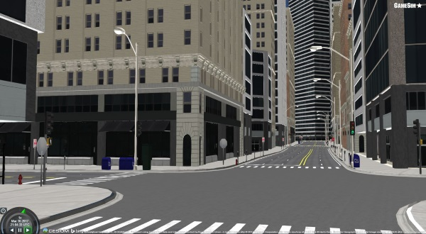
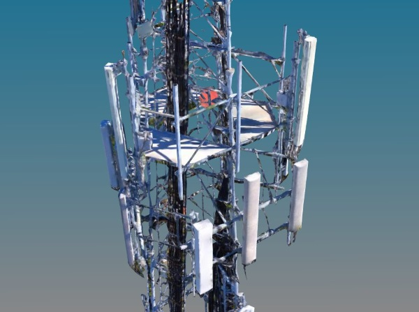

An open specification for streaming massive heterogeneous 3D geospatial datasets.

3D Tiles has entered the Open Geospatial Consortium (OGC) [Community Standard](https://cesium.com/blog/2016/09/06/3d-tiles-and-the-ogc/) process.

## Overview

Bringing techniques from graphics research, the movie industry, and the game industry to 3D geospatial, 3D Tiles define a spatial data structure and a set of tile formats designed for 3D and optimized for streaming and rendering. 

## Specification

* [3D Tiles Format Specification](./specification/)
* [3D Tiles Extension Registry](./extensions/)

## Future Work

Additional tile formats are under development, including Vector Data (`vctr`) [[#124](https://github.com/AnalyticalGraphicsInc/3d-tiles/pull/124)] for geospatial features like points, lines, and polygons. 

See the full roadmap [#TODO](TODO).

## Resources and Related Links

* [**Introducing 3D Tiles**](https://cesium.com/blog/2015/08/10/introducing-3d-tiles/) - the motivation for and principles of 3D Tiles.  Read this first if you are new to 3D Tiles.
* [**The Next Generation of 3D Tiles**](https://cesium.com/blog/2017/07/12/the-next-generation-of-3d-tiles/) - future plans for 3D Tiles.
* [3D Tiles Q&A](./Q-and-A.md)
* **Cesium implementation**
   * Download [Cesium 1.35 or later](https://cesiumjs.org/downloads/) and check out the [Sandcastle examples labeled '3D Tiles'](http://cesiumjs.org/Cesium/Build/Apps/Sandcastle/index.html?src=3D%20Tiles%20BIM.html&label=3D%20Tiles).
   * [Roadmap](https://github.com/AnalyticalGraphicsInc/cesium/issues/3241).
* **Sample data**
   * [3d-tiles-samples](https://github.com/AnalyticalGraphicsInc/3d-tiles-samples) - sample tilesets for learning how to use 3D Tiles
   * [Simple 3D tilesets](https://github.com/AnalyticalGraphicsInc/cesium/tree/master/Specs/Data/Cesium3DTiles) used in the Cesium unit tests.
* **Tools**
   * [3d-tiles-tools](https://github.com/AnalyticalGraphicsInc/3d-tiles-tools) - upcoming tools for debugging, analyzing, and validating 3D Tiles tilesets.
* **Selected Talks**
   * _3D Tiles in Action_ ([pdf](https://cesium.com/presentations/files/3DTilesInAction.pdf)) at FOSS4G 2017.
   * _Point Clouds with 3D Tiles_ ([pdf](https://cesium.com/presentations/files/PointCloudsWith3DTiles.pdf)) at the OGC Technical Committee Meeting (June 2017).
   * _The Open Cesium 3D Tiles Specification: Bringing Massive Geospatial 3D Scenes to the Web_ ([pptx](https://cesium.com/presentations/files/Web3D-2016-3DTilesTutorial.pptx), [example tilesets](https://github.com/AnalyticalGraphicsInc/3d-tiles-samples)) at Web3D 2016.  90-minute technical tutorial.
   * _3D Tiles: Beyond 2D Tiling_ ([pdf](https://cesium.com/presentations/files/FOSS4GNA2016/3DTiles.pdf), [video](https://www.youtube.com/watch?v=I1vYCrMKKEE)) at FOSS4G NA 2016.
   * _3D Tiles motivation and ecosystem update_ ([pdf](https://cesium.com/presentations/files/3D-Tiles-OGC-DC.pdf)) at the OGC Technical Committee Meeting (March 2016).
   * _3D Tiles intro_ ([pdf](https://cesium.com/presentations/files/SIGGRAPH2015/Cesium3DTiles.pdf)) at the Cesium BOF at SIGGRAPH 2015.
* **Selected Articles**
   * [OneSky Using Cesium / 3D Tiles For Volumetric Airspace Visualization](https://onesky.blog/2018/04/16/onesky-using-cesium-3dtiles-for-volumetric-airspace-visualization/). April 2018.
   * [Draco Compressed Meshes with glTF and 3D Tiles](https://cesium.com/blog/2018/04/09/draco-compression/). April 2018.
   * [OGC Testbed-13: 3D Tiles and I3S Interoperability and Performance ER](http://docs.opengeospatial.org/per/17-046.html). March 2018.
   * [Historic Pharsalia Cabin Point Cloud Using Cesium & 3D Tiles](https://cesium.com/blog/2018/02/05/historic-pharsalia-cabin-point-cloud/). February 2018.
   * [Cesium's Participation in OGC Testbed 13](https://cesium.com/blog/2018/02/06/citygml-testbed-13/). February 2018.
   * [Adaptive Subdivision of 3D Tiles](https://cesium.com/blog/2017/08/11/Adaptive-Subdivision-of-3D-Tiles/). August 2017.
   * [Aerometrex and 3D Tiles](https://cesium.com/blog/2017/07/26/aerometrex-melbourne/). July 2017.
   * [Duke Using 3D Tiles for Excavation in Vulci](https://cesium.com/blog/2017/05/22/duke-vulci-photogrammetry/). May 2017.
   * [GERST Engineers, Agisoft PhotoScan, and 3D Tiles](https://cesium.com/blog/2017/05/19/gerst-engineers/). May 2017.
   * [Skipping Levels of Detail](https://cesium.com/blog/2017/05/05/skipping-levels-of-detail/). May 2017.
   * [Infrastructure Visualisation using 3D Tiles](http://www.sitesee.com.au/news/3dtiles). April 2017.
   * [SiteSee Photogrammetry and 3D Tiles](https://cesium.com/blog/2017/04/12/site-see-3d-tiles/). April 2017.
   * [Optimizing Spatial Subdivisions in Practice](https://cesium.com/blog/2017/04/04/spatial-subdivision-in-practice/). April 2017.
   * [Optimizing Subdivisions in Spatial Data Structures](https://cesium.com/blog/2017/03/30/spatial-subdivision/). March 2017.
   * [What's new in 3D Tiles?](https://cesium.com/blog/2017/03/29/whats-new-in-3d-tiles/) March 2017.
   * [Streaming 3D Capture Data using 3D Tiles](https://cesium.com/blog/2017/03/06/3d-scans/). March 2017.
   * [Visualizing Massive Models using 3D Tiles](https://cesium.com/blog/2017/02/21/massive-models/). February 2017.
   * [Bringing City Models to Life with 3D Tiles](https://medium.com/@CyberCity3D/bringing-city-models-to-life-with-3d-tiles-620d5884edf3#.mqxuj7kqd). September 2016.
   * [Using Quantization with 3D Models](https://cesium.com/blog/2016/08/08/cesium-web3d-quantized-attributes/). August 2016.
* **News**
   * [3D Tiles thread on the Cesium forum](https://groups.google.com/forum/#!topic/cesium-dev/tCCooBxpZFU) - get the latest 3D Tiles news and ask questions here.

## Who's using 3D Tiles?

 [Cesium Composer](https://www.cesium.com/) converters |  [Cesium](http://cesiumjs.org/) |
|:---:|:---:|
 [CyberCity3D](http://www.cybercity3d.com/) |  [virtualcitySYSTEMS](http://www.virtualcitysystems.de/en/)  |
 [Cityzenith](http://www.cityzenith.com/) |  [Fraunhofer](http://www.fraunhofer.de/en.html)  |
 [Vricon](http://www.vricon.com/) |  Federal Office of Topography   [swisstopo](https://map.geo.admin.ch)  |
 [Bentley ContextCapture](https://www.linkedin.com/pulse/contextcapture-web-publishing-cesium-aude-camus) |  [Bentley MicroStation](https://www.bentley.com/en/products/brands/microstation) (in progress) |
 [aero3Dpro](http://aero3dpro.com.au/) |  [Entwine](http://cesium.entwine.io/) |
 [GeoRocket](https://georocket.io/) 3DPS |  [OSGJS](http://osgjs.org/) (in progress) |
 [CSIRO Data61](https://www.data61.csiro.au/) |  [GameSim Conform](https://www.gamesim.com/3d-geospatial-conform/) |
 [SiteSee](http://www.sitesee.com.au/) (using three.js) | [Safe FME](https://www.safe.com/how-it-works/) |
[Peaxy](https://peaxy.net/) |  [Prototype Point Cloud Converter](https://github.com/mattshax/cesium_pnt_generator) |
 [VirtualGIS](https://www.virtualgis.io/) |  [LOPoCS ](https://github.com/Oslandia/lopocs) and [py3dtiles](https://github.com/Oslandia/py3dtiles)
 [iTowns 2](https://github.com/iTowns/itowns) |  [osm-cesium-3d-tiles](https://github.com/kiselev-dv/osm-cesium-3d-tiles) |
 [geopipe](https://geopi.pe/) |  [3D Digital Territory Lab](https://cesiumjs.org/demos/grandlyon/) |  
 [Çeşme 3D City Model](https://cesiumjs.org/demos/Cesme3DCityModel/) |

## Live apps

* [NYC](https://cesiumjs.org/NewYork/index.html) by AGI
* [3D Swiss Federal Geoportal with 3 million buildings](https://map.geo.admin.ch/?topic=ech&lang=en&bgLayer=ch.swisstopo.pixelkarte-farbe&layers_visibility=false,false,false,false&layers_timestamp=18641231,,,&lon=8.82169&lat=47.21822&elevation=1213&heading=20.819&pitch=-37.770&layers=ch.swisstopo.zeitreihen,ch.bfs.gebaeude_wohnungs_register,ch.bav.haltestellen-oev,ch.swisstopo.swisstlm3d-wanderwege) by Swisstopo and AGI
* Bentley **ContextCapture**
   * [Orlando](https://d3h9zulrmcj1j6.cloudfront.net/Orlando_Cesium/App/index.html)
   * [Marseille](https://d3h9zulrmcj1j6.cloudfront.net/Marseille_Cesium/App/index.html)
* **aero3Dpro**
   * [Impact Of Coastal Erosion in NightCliff, Darwin](https://sample.aero3dpro.com.au/NightCliffe_2016/App/index.html), [Adelaide](https://adelaide.aero3d.com.au/App/index.html)
   * [Future buildings in Melbourne](https://sample.aero3dpro.com.au/Melbourne/App/index_kml.html)
* **virtualcityMAP** by virtualcitySYSTEMS
   * [10.1 million buildings](http://nrw.virtualcitymap.de/) in North Rhine-Westphalia (34.098 km²)
   * [Textured buildings](http://demo.virtualcitymap.de/?lang=en&layerToActivate=buildings&layerToDeactivate=buildings_untextured)
   * [Textured buildings + point clouds](http://demo.virtualcitymap.de/?lang=en&layerToActivate=buildings&layerToActivate=pointcloud&layerToDeactivate=buildings_untextured&cameraPosition=13.36091%2C52.50023%2C1614.17078&groundPosition=13.36085%2C52.51388%2C33.22668&distance=2192.72&pitch=-46.14&heading=359.84&roll=360.00)
   * [building solar potential](https://t.co/o2P6FXcW7L)
   * [Berlin Atlas of Economy](http://www.businesslocationcenter.de/wab/maps/main/) (switch to 3D and zoom in)
* [Downtown Miami](http://cybercity3d.s3-website-us-east-1.amazonaws.com/?city=Miami) by CyberCity3D and AGI
* [Entwine demos](http://cesium.entwine.io/), including [~4.7 billion points in NYC](http://cesium.entwine.io/?resource=nyc)
* AEROmetrex
   * [Impact Of Coastal Erosion in NightCliff, Darwin](https://sample.aero3dpro.com.au/NightCliffe_2016/App/index.html)
   * [10cm Melbourne, Australia metro](http://sample.aero3dpro.com.au/Melbourne/App/index.html)
   * [Gold Coast, Australia](http://sample.aero3dpro.com.au/Gold_Coast_Cesium/App/index.html)
   * [10cm Sydney, Australia](http://sample.aero3dpro.com.au/Sydney/App/index.html)
   * [Philadelphia](https://sample.aero3dpro.com.au/PHL_Cesium/App/index.html)
   * [10cm Brisbane](https://sample.aero3dpro.com.au/BrisbaneCBD/App/index.html)
* **VirtualGIS**: [2200 Miles of Pipeline](http://kxldemo.virtualgis.io)
* [UrbISOnline: 230,000 buildings Brussels](https://urbisonline.brussels/) ([article](http://bric.brussels/en/news_publications/news/urbis-adm-3d?set_language=en))

Also see the [3D Tiles Showcases video on YouTube](https://youtu.be/KoGc-XDWPDE).

## Data credits

The screenshots in this spec use awesome [CyberCity3D](http://www.cybercity3d.com/) buildings and the [Bing Maps](https://www.microsoft.com/maps/choose-your-bing-maps-API.aspx) base layer.

## Contributing

3D Tiles is an open specification and contributions including specification fixes, new tile formats, and extensions are encouraged. See our guidelines for contributing in [CONTRIBUTING.md](./CONTRIBUTING.md).

---

Created by the <a href="http://cesiumjs.org/">Cesium team</a> and built on <a href="https://www.khronos.org/gltf">glTF</a>. 

 