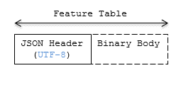

# Feature Table

## Contributors

* Sean Lilley, [@lilleyse](https://twitter.com/lilleyse)
* Patrick Cozzi, [@pjcozzi](https://twitter.com/pjcozzi)
* Rob Taglang, [@lasalvavida](https://github.com/lasalvavida)

## Overview

The _Feature Table_ is used by the [Instanced 3D Model](../Instanced3DModel) and [Point Cloud](../Points) tile formats to define special behavior for each feature in the tile.

For Instanced 3D Models, each instance is a feature, and for Point Clouds, each point is a feature. The features are defined through the use of Feature Table semantics which can be found in the tile format specification.

## Layout

The Feature Table is composed of two parts: a JSON header and a binary body. The JSON keys are tile format semantics, and the values can either be defined directly in the JSON, or refer to locations in the binary.
The binary body is a tightly packed binary buffer containing data used by the header. It is more efficient to store long arrays of data in the binary.

**Figure 1**: Feature Table layout



Code for reading the Feature Table can be found in [Cesium3DTileFeatureTableResources](https://github.com/AnalyticalGraphicsInc/cesium/blob/3d-tiles/Source/Scene/Cesium3DTileFeatureTableResources.js) in the Cesium implementation of 3D tiles.

## JSON Header

Feature table values can be defined in the JSON header in three different ways.

1. A single JSON value. (e.g. `INSTANCES_LENGTH` : `4`)
  * This is common for global semantics like `INSTANCES_LENGTH` and `POINTS_LENGTH`.
2. A JSON array of values. (e.g. `POSITION` : `[1.0, 0.0, 0.0, 0.0, 1.0, 0.0, 0.0, 0.0, 1.0]`)
  * `POSITION` refers to a `float32[3]` data type. This example shows three features: `POSITION(0)`=`[1.0, 0.0, 0.0]`, `POSITION(1)`=`[0.0, 1.0, 0.0]`, `POSITION(2)`=`[0.0, 0.0, 1.0]`.
  * Feature values are always stored as a single, flat array, not an array of arrays.
3. A reference to the binary. (e.g. `SCALE` : { `byteOffset` : `24` } )
  * `byteOffset` is always relative to the start of the binary body.

## Binary Body

When the JSON header includes a reference to the binary, the provided `byteOffset` is used to index into the data. 

**Figure 2**: Indexing into the Feature Table binary


The value can be retrieved using knowledge of the number of features: `featuresLength`, the desired feature id `featureId`, and the data type for the feature semantic.

For example, using the `POSITION` semantic, which has a `float32[3]` data type:

```javascript
var byteOffset = featureTableJSON.POSTION.byteOffset;

var positionArray = new Float32Array(featureTableBinary.buffer, byteOffset, featuresLength * 3); // There are three components for each POSITION feature.
var position = positionArray.subarray(featureId * 3, featureId * 3 + 3); // Using subarray creates a view into the array data, and not a new array, which is better for performance.
```

## Implementation Notes

This may vary between implementations, but in javascript, a `TypedArray` cannot be created on data unless it is byte-aligned.
This means that a `Float32Array` must be stored in memory such that its data begins on a byte multiple of four since each `float` contains four bytes.
The data types used in 3D Tiles have a maximum length of four bytes, so padding to a multiple of four will work for all cases, since smaller types with lengths of one and two will also be byte-aligned.

If the string generated from the JSON header has a length that is not a multiple of four, it can be padded with space characters in order to ensure that the binary body is byte-aligned.
The binary body should also be padded to a multiple of four when there is data following the Feature Table.